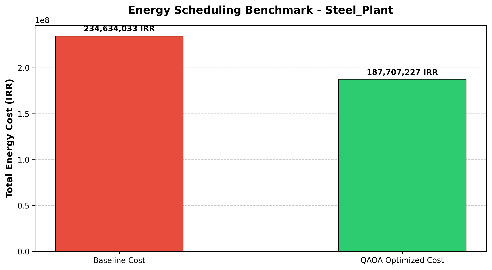

# Hybrid-Quantum-Energy-Optimization

[](LICENSE)
[](https://www.python.org/)
[](https://qiskit.org/)

A research-grade hybrid quantum-classical framework designed to optimize heavy industrial energy load scheduling (Steel Arc Furnaces, Petrochemical Compressors, etc.) using the Quantum Approximate Optimization Algorithm (QAOA) coupled with official tariff structures from the Iran Grid Management Company (IGMC).

---

## 🚀 Quick Start / Run in Google Colab

You can run the complete end-to-end pipeline (from data ingestion and QUBO formulation to QAOA execution and cost benchmarking) directly in your browser using Google Colab:

* **[Open Master Notebook in Google Colab](https://colab.research.google.com/github/amirkabirian/Hybrid-Quantum-Energy-Optimization/blob/main/notebooks/Hybrid_Quantum_Energy_Optimization_Master.ipynb)**

---

## 📐 Mathematical Formulation & Methodology

Industrial energy optimization involves scheduling machine operations across multiple time slots to minimize total electricity costs while strictly respecting operational constraints.

### 1. Cost Objective (QUBO Linear Terms)
The objective function minimizes the cost calculated by the product of power consumption $P_m$ of machine $m$ and the time-dependent electricity tariff rate $T_t$:

$$\min \sum_{m} \sum_{t} P_m \cdot T_t \cdot x_{m,t}$$

where $x_{m,t} \in \{0, 1\}$ are binary decision variables indicating whether machine $m$ operates in time slot $t$.

### 2. Constraint Enforcement (Penalty Method)
To ensure physical feasibility (e.g., each machine must run **exactly once** across the available slots), we incorporate strict penalty terms with Lagrangian multiplier $\lambda_1$:

$$\mathcal{H}_{\text{constraint}} = \lambda_1 \sum_{m} \left(1 - \sum_{t} x_{m,t}\right)^2$$

### 3. Quantum Translation & Hybrid Solver
* **QUBO to Ising Mapping:** The formulated QUBO matrix $Q$ is mapped into a weighted sum of Pauli-$Z$ operators (Ising Hamiltonian) via SparsePauliOp.
* **QAOA Circuit Execution:** The parameterized quantum circuit (`QAOAAnsatz`) is executed on the Qiskit `AerSimulator` backend with proper circuit transpilation.
* **Classical Optimization Loop:** The hybrid loop utilizes SciPy's `COBYLA` optimizer to iteratively update variational parameters $(\gamma, \beta)$ until convergence to the optimal cost configuration.

---

## 📊 Results & Performance Benchmark

The hybrid framework successfully reduces heavy industrial energy expenses compared to conventional baseline allocations by shifting operational loads to optimal tariff windows.



---

## 📂 Repository Structure

```text
Hybrid-Quantum-Energy-Optimization/
│
├── data/
│   └── iran_industrial_energy_data.csv   # Official IGMC tariff and peak load structures
│
├── notebooks/
│   └── Hybrid_Quantum_Energy_Optimization_Master.ipynb  # Complete master notebook
│
├── benchmark_result.png                  # High-resolution performance visualization chart
├── LICENSE                               # Proprietary All Rights Reserved License
└── README.md                             # Project documentation
